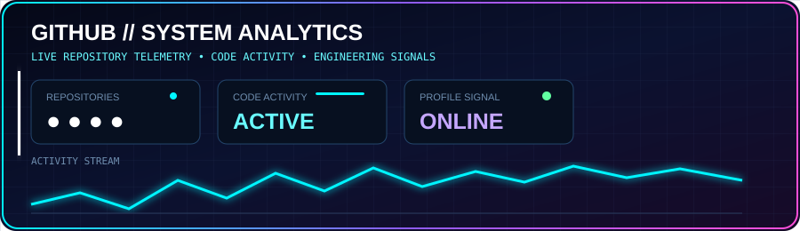
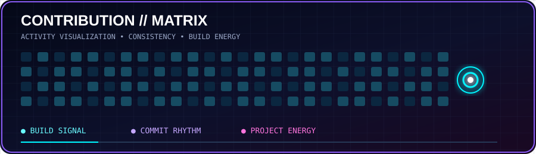
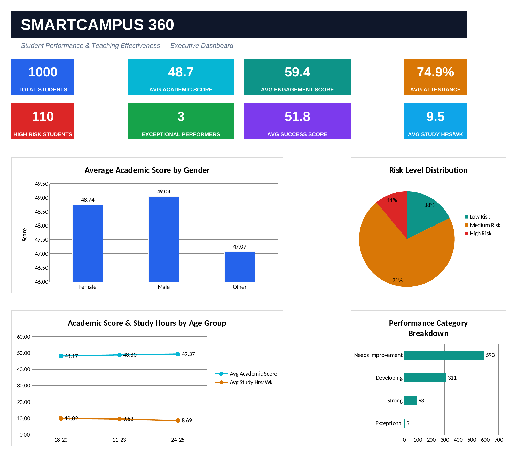
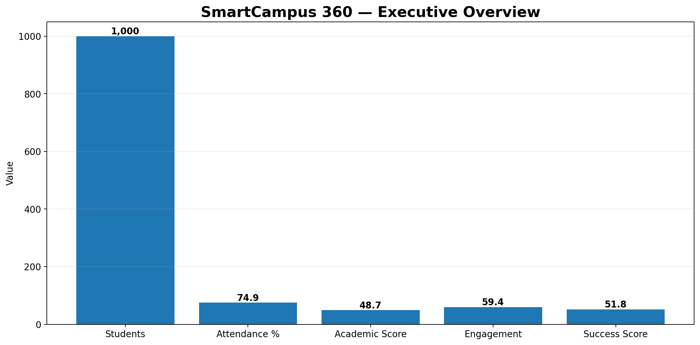
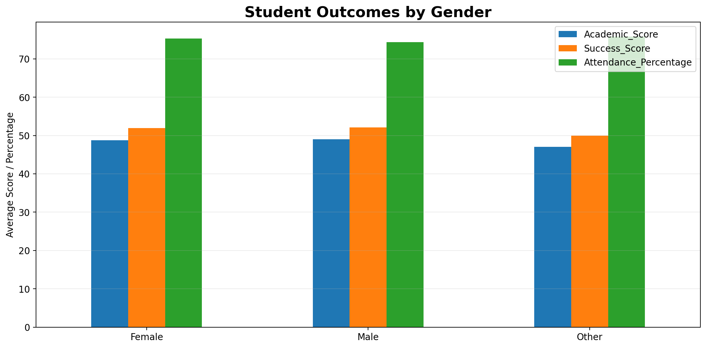
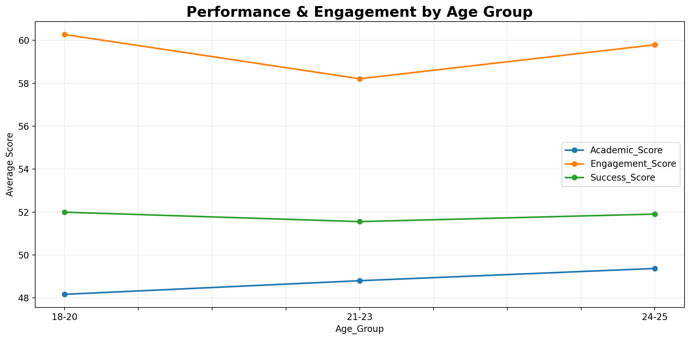
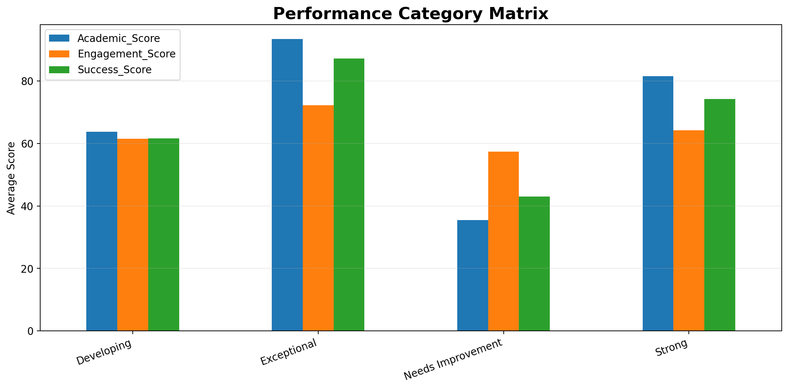
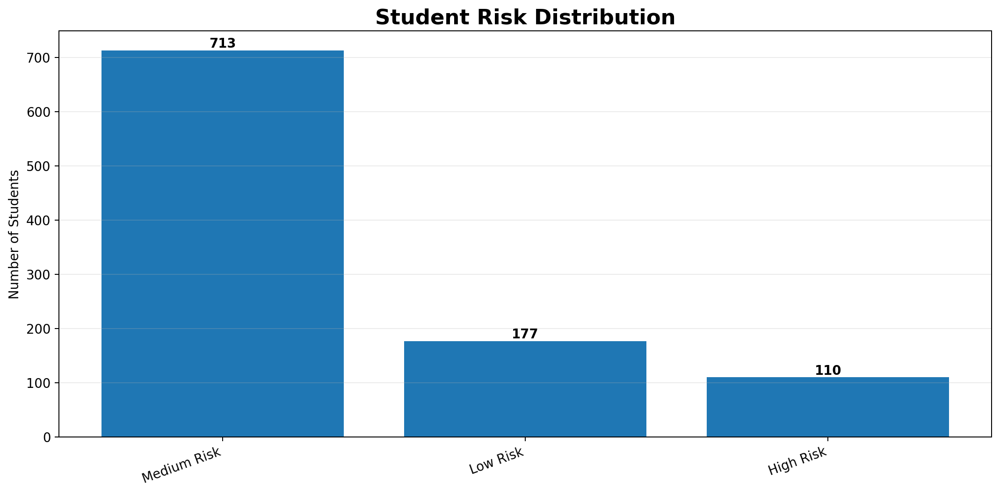
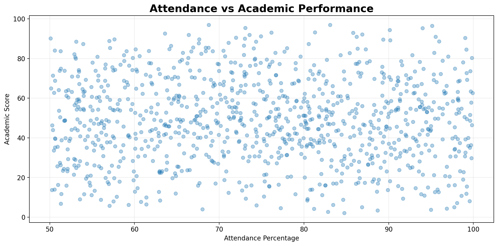

  

## 🎯 About Me

I'm a final-year Computer Science graduate (University of Delhi) who got hooked on the intersection of **AI/ML and real-world problem solving** — specifically how machine learning can fight fraud in banking. My research on AI-driven fraud prevention was presented at an **international conference (March 2026)**, and I'm certified as a Business Analyst, which means I care as much about the "why it matters to the business" as I do about the model accuracy.

## 🔬 Research & Projects

**AI in Fraud Detection & Prevention in Banking** — *Research, Aug 2025–Mar 2026*
- Developed & evaluated Random Forest, XGBoost, Gradient Boosting, and Neural Network models for fraud detection
- Applied feature engineering and rigorous evaluation to improve detection accuracy
- Presented findings at an international conference

**Credit Card Fraud Detection** — *ML Project, Nov 2023–Jan 2024*
- Built Logistic Regression + Anomaly Detection models achieving **97% accuracy**
- Used Cross-Validation, SMOTE oversampling, and EDA to reduce false negatives

## 🛠️ Tools & Tech

**Languages:** Python, C++, SQL, PHP, JavaScript, HTML/CSS, LaTeX
**ML/AI:** TensorFlow, PyTorch, Scikit-Learn, XGBoost, SMOTE, Feature Engineering
**Data & BI:** Power BI, Excel, MySQL, PostgreSQL
**Design:** Figma, Canva Pro, Adobe Illustrator

## 📊 GitHub Stats

  

  

## 📊 Data Analytics & Dashboard Projects

### 🏫 SmartCampus 360 — Executive Analytics Dashboard

> A student-performance analytics dashboard focused on academic
> performance, attendance, engagement, risk analysis, and student
> success indicators.

  

  

### 📈 Analysis & Insights

  
  

  
  

  

### 🛠️ Tools & Techniques

`Microsoft Excel` • `Data Cleaning` • `Pivot Tables` •
`KPI Analysis` • `Data Visualization` • `Dashboard Design`

📥 [Download SmartCampus 360 Dashboard](./SmartCampus360_Executive_Dashboard.xlsx)
  
## 🎤 Speaking

- Featured Speaker — International Girls in ICT Day (AIR FM Rainbow 102.6), Apr 2026
- Guest Speaker — Alpha Gen: Youth Speaks (Prasar Bharati), May 2026

## 🚀 Open To

Entry-level roles / internships in **AI/ML Engineering, Data Science, or Data Analytics**

## 📫 Connect

[LinkedIn](https://linkedin.com/in/YOUR-LINKEDIN-HERE) · [Email](mailto:aditideshwal1234@gmail.com)
